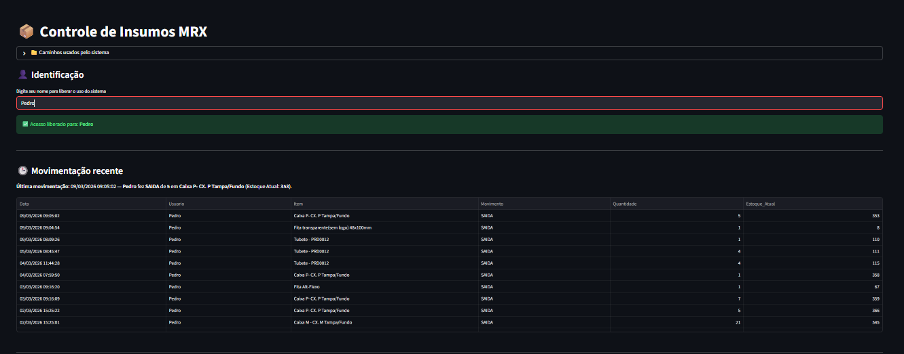
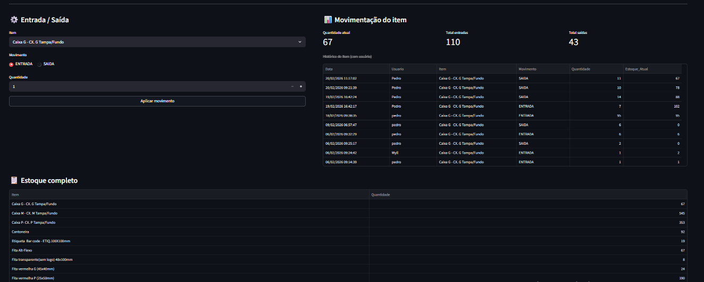

&nbsp;      Industrial Inventory Management System

Este projeto é uma solução de \\Controle de Insumos e Logística\\ desenvolvida para otimizar o fluxo de estoque. O sistema foca em integridade de dados e continuidade de negócio via espelhamento em nuvem.

---

\  Visualização do Dashboard

&nbsp; Diferenciais Técnicos

Arquitetura de Sincronização Dupla: O sistema opera com uma base local (Excel) para alta performance e realiza o espelhamento automático (Mirroring) para o Dropbox, garantindo redundância e backup em tempo real.

Rastreabilidade (Logs): Todo movimento gera um registro no histórico contendo Data, Hora e Usuário, permitindo auditoria completa das operações.

Interface de Métricas: Dashboard integrado que calcula automaticamente o total de entradas e saídas por item selecionado.

🛠️ Tecnologias Utilizadas

Linguagem: Python

Interface Web: Streamlit

Engine de Dados: Pandas \& OpenPyXL

Gestão de Arquivos: Pathlib \& Shutil (para automação de backups)

&nbsp;Visualização do Sistema

&nbsp;Como Executar

Clone o repositório:

Bash

git clone https://github.com/Luxn1er/Sistema-de-gestao-de-insumos.git

Instale as dependências:

Bash

pip install streamlit pandas openpyxl

Configure os caminhos:

Crie uma pasta data/ na raiz do projeto e ajuste as variáveis ARQUIVO\_LOCAL e ARQUIVO\_DROPBOX no topo do arquivo app.py.

Inicie o sistema:

Bash

streamlit run app.py

Desenvolvido por Pedro Juan Moreira Sena Estudante de ADS | Analista de Dados | Desenvolvedor Full Stack

